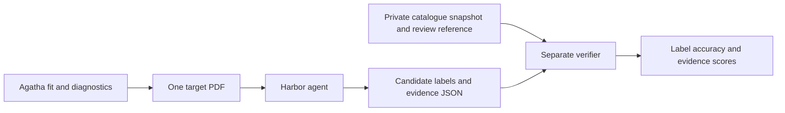

# Harbor tasks for RV-report vetting

One task is one **anonymized host-system PDF**. The agent predicts the catalogue
label of every candidate and assesses the RV evidence, producing structured
JSON. RV fitting and PDF production happen before the Harbor trial. The agent
receives no RV files, target names, coordinates, individual truth labels, or
other systems' reports.

The source sample has 17 systems. The export keeps a system only when **every
catalogue candidate has a distinct recovered RV-periodogram peak nearby**,
independent of catalogue status. A period-constrained Keplerian fit alone does
not qualify it.

Default recovery rule: top 10 local peaks, relative period error <=5%, and
conditional ln BF >=5. Only sequential scans before that candidate is removed
are eligible. Repeated peaks closer than 1/baseline in frequency form one
unresolved signal; a one-to-one match prevents reusing it for two candidates.
Missing catalogue periods exclude the whole system. These are checks on the
cached catalogue-informed scans, not a new blind search.

This leaves **5 systems / 6 candidates**:

| Split | Systems | Candidates |
|---|---|---:|
| Validation | V03, V04, V06, V08 | 5 |
| Test | T07 | 1 |

Original split assignments are preserved and hosts do not overlap. The former
9+9 balance does not survive the all-candidates-recovered constraint. The
single-system test subset is too small for a balanced classification evaluation; do not describe it as the original 9+9 benchmark.
The same five systems qualify under a 1% tolerance for this snapshot.



## Install and build

Use Python 3.13 and Docker. This integration was tested against Harbor **0.22.0**,
using its **1.4** task schema.

```bash
python -m venv /path/to/harbor-env
/path/to/harbor-env/bin/pip install -r harbor_vetting/requirements.txt

# Build public dependencies once, before enforcing no-network task execution.
# --network=host is useful on Linux hosts with restricted Docker bridge DNS.
docker build --network=host -t rv-pdf-review-base:1.0.0 \
  -f harbor_vetting/base.Dockerfile harbor_vetting

/path/to/harbor-env/bin/python harbor_vetting/build_tasks.py \
  /path/to/analysis/agatha_run /path/to/datasets/harbor_rv_recovered
```

The dependency image uses a digest-pinned Python base and pinned PyMuPDF and
jsonschema versions. OS packages resolve when building the image; retain the
built image ID with an evaluation run. Nothing is pushed to a registry.

The exporter selects the methods page and five target pages, renumbers physical
pages 1–6, cleans shared PDF resources, and audits names/aliases and other target
codes. It does not rerun the numerical fits. To export just one PDF:

```bash
python scripts/export_target_report.py \
  /path/to/agatha_rv_report_anonymized.pdf V04 /path/to/V04.pdf
```

To make task generation the final step of the existing fit/report pipeline,
install the Harbor requirements in the same Python environment as the fitting
pipeline and pass:

```bash
python scripts/headless_vetting.py DATASET FIT_OUTPUT \
  --rscript /path/to/Rscript --workers 6 \
  --harbor-output /path/to/datasets/harbor_rv_recovered
```

The task builder accepts `--codes V04 T07`, `--period-tolerance 0.01`,
`--top-peaks 10`, and `--min-logbf 5` (or `none`). Codes are still subject to the
all-candidate recovery filter. `recovery_selection.json` and
`recovery_audit.csv` explain every accepted and excluded system. Output task directories must
not already exist: use a new versioned output path when rebuilding a benchmark.
The source fitting output must have its completed aggregate PDF, per-target
results, identity/alias keys and frozen `private_candidates.csv`.

## Run a task or split

```bash
# Infrastructure check: privileged reference answer, no model API calls.
harbor run -p /path/to/datasets/harbor_rv_recovered/val/rv-pdf-v04 \
  -a oracle --jobs-dir /path/to/jobs --job-name oracle-v04

# Empty agent must receive zero, not accidentally pass the verifier.
harbor run -p /path/to/datasets/harbor_rv_recovered/val/rv-pdf-v04 \
  -a nop --jobs-dir /path/to/jobs --job-name nop-v04

# Evaluate an agent on validation; supply your own model/provider configuration.
harbor run -p /path/to/datasets/harbor_rv_recovered/val \
  -a terminus-2 -m "$RV_VETTING_MODEL" --jobs-dir /path/to/jobs \
  --job-name rv-validation -n 4

# Preserve the test split for the final evaluation.
harbor run -p /path/to/datasets/harbor_rv_recovered/test \
  -a terminus-2 -m "$RV_VETTING_MODEL" --jobs-dir /path/to/jobs \
  --job-name rv-test -n 4

python harbor_vetting/summarize_run.py /path/to/jobs/rv-test \
  --output /path/to/rv-test-summary.json
```

Harbor's default task mean weights host systems equally. Use the supplied
aggregator for **candidate-weighted** metrics, because hosts have different
numbers of components. Repeated attempts count separately. Incomplete jobs are
explicitly marked and must not be reported as complete benchmark scores.

## Task interface

Agent-visible files:

- `/workspace/report.pdf`: six physical pages, only one system.
- `/workspace/submission.schema.json`: strict JSON contract.
- `/workspace/answer_template.json`: IDs and empty fields only.
- `/workspace/pdf_tool.py`: text extraction and page rendering.

The agent writes `/workspace/output/verdict.json`. For every candidate it must
provide a catalogue prediction, probability of confirmation, an RV assessment,
fitted numerical values, review flags, two page quotations, and a rationale.
System-level fields cover observation/component counts, residual fit quality
and each instrument's selected noise model. The exact protocol and numerical
rounding rules are in `instruction.md` and the schema.

Each generated task contains:

```text
rv-pdf-v04/
  task.toml
  instruction.md
  environment/             # agent image; PDF + tools + empty template only
  tests/                   # separate verifier image; private reference
  solution/                # privileged oracle answer; only injected for oracle
```

The environment and verifier have no runtime network access. The agent runs as
an unprivileged user. Only the output directory transfers to the separate
verifier, which compares against its own immutable reference, not agent files.
The image build contexts do not include parent directories or host data.

## Scoring

Two kinds of reference are deliberately distinct:

1. **Catalogue truth:** confirmed/retracted status from the frozen selected
   exoplanet.eu entries. This is used only for label-prediction evaluation.
2. **Review protocol:** explicit report-based numerical thresholds and flags.
   This checks reproducible reading and interpretation; it is not independently
   adjudicated planetary truth.

```text
reward = 0.5 × catalogue_accuracy + 0.5 × evidence_score

evidence_score = 0.15 × system facts
               + 0.15 × instrument noise choices
               + 0.25 × candidate numerical facts
               + 0.20 × review-flag F1
               + 0.15 × protocol assessment accuracy
               + 0.10 × valid page quotations
```

The protocol calls a candidate `unsupported` when drop-component delta BIC is
at most 10, otherwise `inconclusive` if a review flag applies, and otherwise
`conditionally_supported`. The catalogue prediction can differ. Missing
measurements or diagnostics are not treated as proof against a planet.

Confidence Brier score is an additional metric (**lower is better**). The
verifier checks quoted text against the original target PDF, including page
numbers and a candidate-specific quotation. It retains free-text rationales
for human review but does **not** semantically judge their scientific quality.
No additional LLM judge or API credential is required by the verifier.

Malformed JSON, non-finite numbers, schema violations, duplicate/missing
candidates, incorrect instrument sets, or inconsistent confidence/class choices
receive zero. Scoring references never come from the agent environment.

## Interpretation and privacy

Some catalogue retractions concern companion classification or evidence not
available in an RV-only PDF. A real RV signal therefore does not establish a
confirmed planetary label. Systems without matches for every candidate,
including the poorly fitted T04 and T09, are excluded by recovery selection. Reported
scores measure this particular prediction/review task; they are not a claim
that the PDF alone determines catalogue status or validates a planet.

IDs and individual labels are hidden in the input, but recognizable periods and
RV patterns can reveal familiar systems. This is pseudonymization, not a formal
guarantee of anonymity. Task source directories include hidden scoring labels
and oracle answers: give the agent only the built environment through Harbor,
not a host mount of the task source or the whole fitting output. The generated
`provenance.PRIVATE.json` belongs with evaluation records, not agent inputs.

The builder writes no generated tasks into the source repository, and does not
publish benchmark inputs, labels, images or evaluation results.

## Verify the implementation

```bash
pip install pytest
RV_HARBOR_TASKS=/path/to/datasets/harbor_rv_recovered \
  pytest -q harbor_vetting/tests
```

Tests cover all task definitions, perfect oracles, independent label/evidence
scores, adversarial JSON, missing/duplicate candidates, hallucinated quotations
and numbers, filtered split membership, and unused PDF image resources. Recovery tests additionally cover period
priors without peaks, missing periods, distinct-peak matching, subtraction
order, peak rank, evidence thresholds and catalogue-label independence. Run Harbor's oracle
and no-op agents as above to check Docker transfer and reward-file handling.
An oracle pass validates task plumbing; it is not an agent performance result.

Task format and isolated verifier behavior follow the
[official Harbor task documentation](https://www.harborframework.com/docs/tasks).
